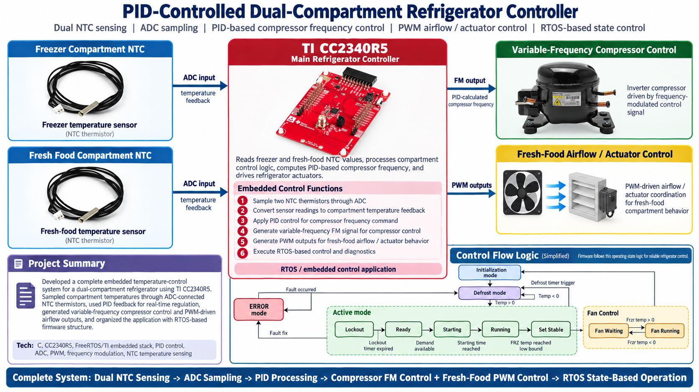
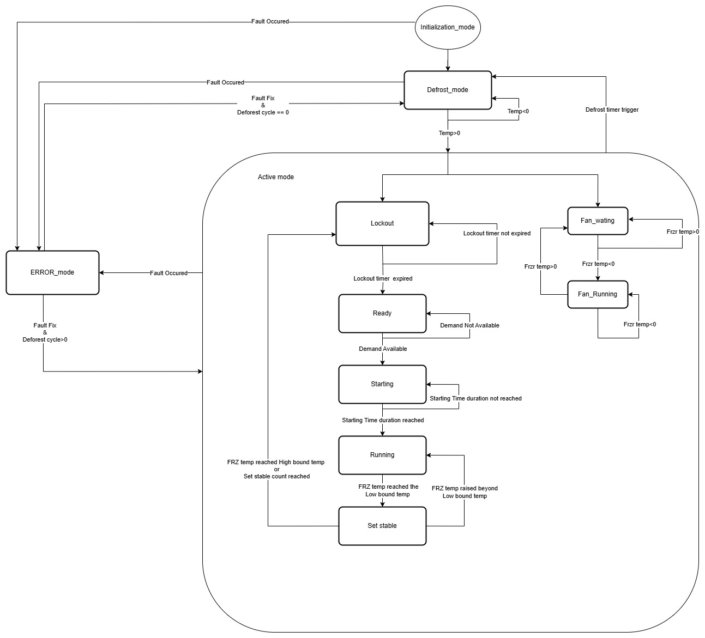

# PID-Controlled Dual-Compartment Refrigerator Controller



Embedded refrigerator-control prototype for the **Texas Instruments CC2340R5**. The controller samples NTC thermistors in the freezer and fresh-food compartments, applies PID-based demand control, produces a frequency-modulated compressor command, and coordinates PWM-driven airflow and other refrigerator actuators under FreeRTOS.

## System overview

```text
Freezer NTC -----\
                  +--> CC2340R5 ADC --> control/state logic --> PID --> compressor FM command
Fresh-food NTC --/                                 |
                                                   +-------> fan/airflow PWM
                                                   +-------> heater and diagnostics
```

The CC2340R5 firmware combines:

- Four configured ADC channels, including the two compartment temperature inputs
- Freezer-loop PID control and a bounded/ramped compressor frequency command
- Fresh-food PID control and fan PWM duty control
- Compressor lockout, ready, starting, running, and set-stable states
- Initialization/defrost, active, and error operating modes
- Fan waiting/running behavior coordinated with freezer conditions
- UART framing, nonvolatile settings support, I2C display support, GPIO, and BLE framework components

## Control flow

The detailed operating-state model is shown below. It covers initialization, defrost handling, fault recovery, compressor lockout/start/run/stabilization, and freezer-dependent fan transitions.



At a high level:

1. The ADC samples the freezer and fresh-food NTC voltage dividers.
2. Sensor conversion logic maps the readings to temperature feedback.
3. The control task evaluates mode, faults, timers, and cooling demand.
4. The freezer PID result is mapped to a bounded compressor frequency command.
5. The fresh-food PID result is mapped to a fan PWM duty command.
6. Defrost, lockout, fan, heater, UART, NVS, and BLE services run around the control loop.

## Hardware and toolchain

- TI CC2340R5 / LP-EM-CC2340R5 target
- Two NTC thermistors with suitable ADC voltage-divider and protection circuits
- Compressor inverter/controller that accepts the required frequency-modulated command
- PWM-compatible fan/airflow actuator and suitable power driver
- Code Composer Studio with TI Arm Clang **4.0.3 LTS**
- SimpleLink Low Power F3 SDK **9.12.0.19**
- SysConfig **1.23.2**
- FreeRTOS (configured through the SimpleLink SDK)

The exact peripheral assignments are maintained in [`basic_ble.syscfg`](basic_ble.syscfg). Verify the generated pin mapping against your board revision before connecting hardware.

## Building in Code Composer Studio

1. Install Code Composer Studio, SimpleLink Low Power F3 SDK `9.12.0.19`, SysConfig `1.23.2`, and TI Arm Clang `4.0.3.LTS`.
2. Choose **File > Import > CCS Projects** and select this repository directory.
3. Confirm that CCS resolves `COM_TI_SIMPLELINK_LOWPOWER_F3_SDK_INSTALL_DIR` and the linked SDK resources declared in `.project`.
4. Open `basic_ble.syscfg`, review all ADC/PWM/GPIO/I2C/UART assignments, and let SysConfig regenerate the board files.
5. Select the `Release` configuration and build the `CC2340R5` project.
6. Connect the target using `targetConfigs/CC2340R5.ccxml`, then flash and debug from CCS.

Generated `Debug/`, `Release/`, object, map, ELF/OUT, HEX, and IDE-cache files are intentionally excluded from version control. A clean build recreates them locally.

## Repository layout

```text
.
|-- app/
|   |-- Drivers/        # ADC, PID, FM, PWM, GPIO, UART, NVS, and I2C helpers
|   |-- Services/       # Sensor and refrigerator actuator services
|   |-- Profiles/       # BLE application profiles
|   `-- app_main.c      # FreeRTOS control task and top-level mode handling
|-- common/Startup/     # Application/stack startup integration
|-- docs/images/        # Architecture, state-flow, and hardware reference images
|-- targetConfigs/      # CC2340R5 debug target configuration
|-- basic_ble.syscfg    # Peripheral, FreeRTOS, radio, and BLE configuration
|-- cc2340_freertos.cmd # Linker command file
`-- main_freertos.c     # Firmware entry point and RTOS startup
```

## Configuration and calibration

Before running on a refrigerator, review and calibrate:

- NTC nominal resistance, beta/Steinhart-Hart coefficients, divider resistance, ADC reference, and allowable sensor range
- Freezer and fresh-food setpoints and deadbands
- PID gains, integral limits, update interval, and output scaling
- Compressor minimum/maximum command frequency, ramp rate, startup time, and anti-short-cycle lockout
- Fan frequency and duty limits
- Defrost interval, termination temperature, maximum duration, and fault behavior
- UART/NVS parameter validation and fallback defaults

Control constants and shared state currently live primarily in `app/Drivers/GLOBAL.h`, `app/Drivers/GLOBAL.c`, `app/globals.h`, and `app/globals.c`.

## Development status

This repository contains prototype firmware and the intended control architecture. Some code paths are explicitly marked `TODO`, including sensor conversion/calibration, initialization, persistence, and parts of mode/state handling. Treat the diagrams as the design target and validate the checked-in implementation, timing, pinout, fault handling, and output waveforms on a safe test bench before integration.

## Safety

This project is not a certified appliance controller. A CC2340R5 output must **not** drive a mains compressor, fan, or heater directly. Use the compressor manufacturer's approved inverter/control input, appropriate isolation and level shifting, protected power stages, fusing, grounding, watchdogs, independent thermal cut-outs, and fail-safe shutdown behavior. Work on mains-powered refrigeration equipment should be performed by qualified personnel.
